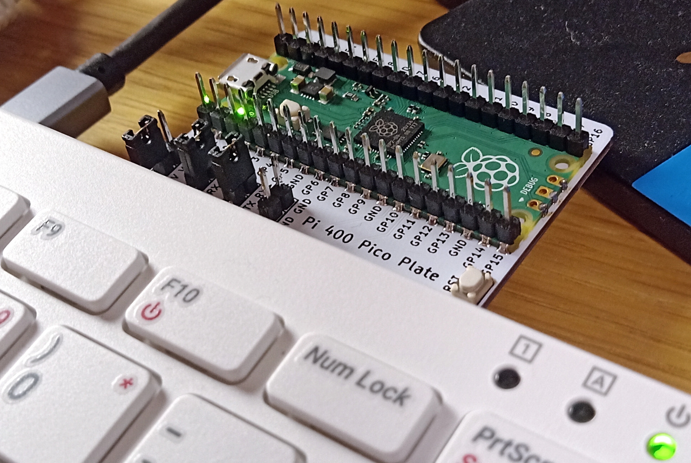
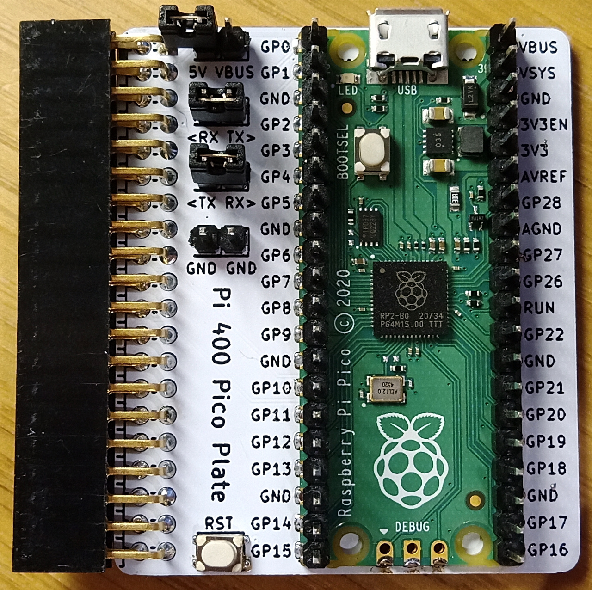

Pi 400 Pico Plate
=================

This board connects a Pico to the GPIO header on a Pi 400, without any wires flapping in the breeze. [See the schematic here (PDF)](pi400-pico-plate.pdf).

I made this to use at work. Besides connecting power and debug, it clearly labels the Pico pinout when viewed from the top:

- Pico VSYS is powered from Pi +5V rail
- Pico SWD is connected to Pi GPIO 24/25
- Pico RUN pin is connected to a push-button
- *(jumper)* Pico UART on GPIO0/1 is connected to Pi GPIO14/15
- *(jumper)* Pico VBUS is powered from +5V rail so Pico can function as USB host

That's it, that's the whole thing. This repository is CC0-licensed, with the exception of the 3d models in the `3d/` directory.

The board is designed with KiCad nightly; if you don't have KiCad nightly installed, you can find pregenerated gerbers of the rev A PCB in the `gerb/` directory, which are suitable for manufacture by JLCPCB.
